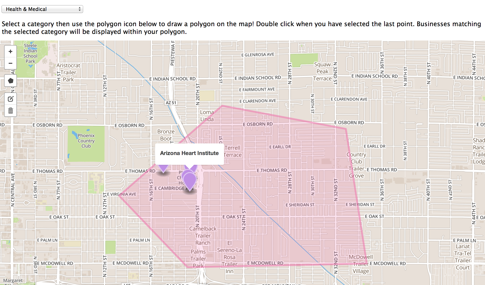

# Neo4j Spatial Demo for map visualization using yelp data set

This repo contains the client code the python scripts for importing data that power.

#To run the program Follow the steps:

##1) Clone the repo.

##2)Unzip the file.

##3)Run file index.html in your web browser.

Here yelp dataset with mapBox api is used. Further development is be done using GoogleMap API.
For a selected region using a polygon we can find business with different categories.
